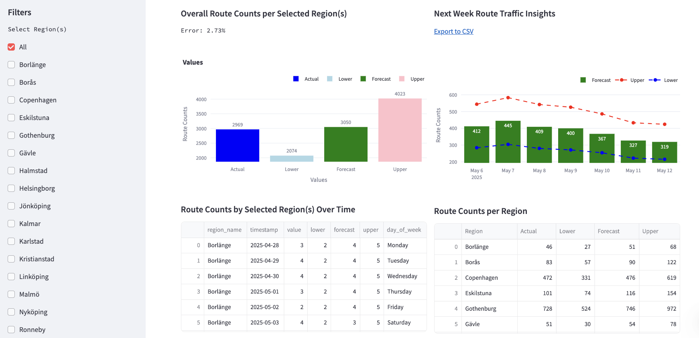

# Forecast Dashboard

A Streamlit-based dashboard for visualizing route forecast data, including overall route counts, weekly forecasts, and detailed tables by region.



## Features

- **Interactive Filters**: Select regions and time ranges to filter data.
- **Visualizations**:
  - Bar chart for overall route counts (Actual, Lower, Forecast, Upper).
  - Combined bar and line chart for weekly forecasts with upper and lower bounds.
- **Tables**:
  - Route counts over time by region.
  - Total route counts per region.
- **Export**: Download weekly forecast data as a CSV file.

## Directory Structure

```bash
  Root/
  ├── Dockerfile
  ├── docker-compose.yml
  ├── requirements.txt
  ├── README.md
  └── src/
  ├── init.py
  ├── app.py
  ├── config.py
  ├── data/
  │   ├── init.py
  │   ├── loader.py
  │   └── preprocessor.py
  ├── utils/
  │   ├── init.py
  │   └── export.py
  └── visualization/
  ├── init.py
  ├── charts.py
  └── tables.py
```

## Installation

### Prerequisites

- Docker (optional, for containerized deployment)
- Python 3.9+

### Setup

1. Clone the repository:

   ```bash
   git clone <repository-url>
   cd root
   ```

2. Install dependencies:

    ```bash
    pip install -r requirements.txt
    ```

3. Ensure the report directory exists with your data file (results_fi_fu.csv by default):

    ```bash
    root/src/report/results_fi_fu.csv
    ```

## Running the Dashboard

### Locally

Run the Streamlit app directly:

```bash
cd src
streamlit run app.py
```

Access the dashboard at <http://localhost:8501>.

### Using Docker Compose

1. Build and run the container:

```bash
docker-compose up --build
```

Access the dashboard at <http://localhost:8501>.

2. Environment Variables

- FORECAST_FILE_NAME: Specifies the CSV file name (default: results_fi_fu).
  - Set in docker-compose.yml or your shell:
  
```bash
export FORECAST_FILE_NAME=your_file_name
```

## Development

- ### Adding New Features

  - Add new visualization functions in src/visualization/.
  - Add utility functions in src/utils/.
  - Update src/app.py to include new components in the dashboard.

- ### Live Changes

  - When using Docker Compose, the src/ directory is mounted, so local changes are reflected automatically in the container.

## Dependencies

See `requirements.txt` for a full list of dependencies.

License
This project is licensed under the MIT License.

### Steps to Run

1. Create the directory structure as shown above.
2. Save each file with its respective content.
3. Ensure the `report` directory exists inside `src/` with your data file (`results_fi_fu.csv`).
4. Install dependencies:

   ```bash
   pip install -r requirements.txt
   ```

5. Run the app:

- Locally:

    ```bash
    cd src
    streamlit run app.py
    ```

- With Docker Compose:

    ```bash
    docker-compose up --build
    ```

6. Access the dashboard at <http://localhost:8501>.
